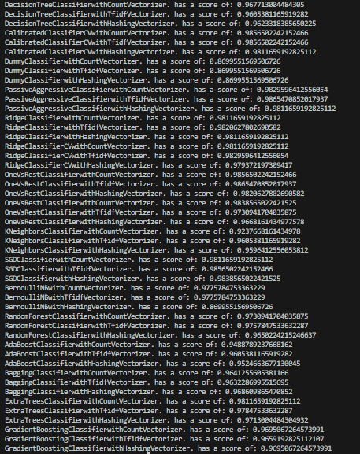

# 📂 SMS Spam Detection
This project classifies SMS messages as spam or ham (not spam). 
It compares multiple classifiers and vectorizers to determine the best performance.

## Features
### Classifiers:

- DecisionTreeClassifier

- CalibratedClassifierCV

- DummyClassifier

- PassiveAggressiveClassifier

- RidgeClassifier

###  Vectorizers:

- CountVectorizer

- TfidfVectorizer

- HashingVectorizer

### Dataset:
- A CSV file containing SMS messages labeled as either "spam" or "ham".

## Usage
- clone this repo with `git clone https://github.com/Adagedo/sms-spam-detector-sklearn.git`
- install dependencies with `pip install requirement.txt`
- After running the model, you should see an output like this. 

## 📝 Notes
The CSV file should have at least two columns:

- v1: label (ham/spam)

- v2: message text

Results are printed to the console or just take a look at the csv file.